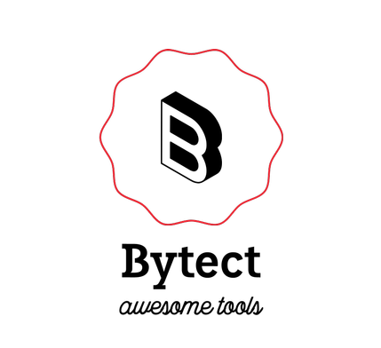
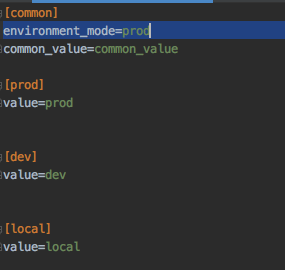

<p align="center">
</p>


# Welcome to Envmanager for Python Docs

Envmanager is a reliable tool to parse environment variables by providing a typing schema, in the most efficient way.

Here is how you would use this library:

1 - Define your schema as an enum or dictionary

2 - Load cfg files using the loader function or decorator:

3 - Use the same enum to get the keys, parsed according to the schema


Here is how your code may look like:

_schema_definition.py_
```python
from marshmallow import fields

schema = { 
    "an_int_value": int, # use builtin types like str, int, float to parse the variables
    "email": fields.Email(),  # use full power of Marshmallow validator to parse your environment varialbes
    "custom_key": MyCustomValidator(),  # you can pass your own validator object to validate and parse custom environment variables!
}

...

from envmanager import EnvManagerConfig

envloader_config = EnvManagerConfig( 
    env_paths=['path/to/my_env_file.cfg'], 
    schema=schema,  # optional
    eager_validate=True  # validate the env variables based on the schema upon assigning them as environment variables 
)
```

*my_env.cfg*
```
[common]
an_int_value = 10
email = bytectgroup@gmail.com
custom_key = this_will_be_validated_by_me
```

_main.py_
```python
from envmanager.decorators import env_loader

@env_loader(envloader_config)  # saves all cfg file content onto the os.environ
def app_entry_point():
    from my_project import App  # ENSURE you do not import env-variable dependent code prior to envl_loader being called
    App.start()
```

_my_project.py_
```python
from envmanager import Env
env = Env(envloader_config)  # pass the same envloader config object to Env class

def app_entry_point():
    print(env('an_int_value'))  # prints as integer
    print(env('custom_key'))  # prints as expected by your custom validator/parser
    print(env('email'))  # prints valid email
```

## Documentation

### Guidelines


* Envmanager does stuff behind the scene to set and get environment variables. All keys will be prepended by uppercase
value of each group as specified in configuration (i.e. EnvManagerConfig object) to ensure no collision between identical
keys in two different groups.

### Environment Variable Files
> IMPORTANT NOTE: You must provide your environment variables inside a cfg file. No other file extension is supported at this point. Read more on cfg file format [here](https://docs.python.org/3/library/configparser.html). 


#### Sections:
Envmanager is created with scalability in mind. It is often the case that your environment variables are dependent on which environment your application is being run from (e.g. prod vs dev) while some variables are common.
The way Envmanager works is that it **takes exactly two sections per config file**: one **"common"** and one **"environment dependent"**.


#### Mode

The mode, which tells the envmanager which section (in addition to the common section) is to be read, is denoted by the key named "environment_mode".

* Defining the mode in-file style:

    If this value is missing, simply the common section values will be read and maybe validated/parsed (if schema is provided).
    
    
    
    Notice how the mode is named after the available section in the file. Changing the mode to dev will result in the host value being equal to 'dev-host' during run-time.
    
    - Note#1
        
    > You are NOT obligated to specify mode or any other section than the one you want. Either ensure the section name is set to "**common**" or specify the name using "**common_section_identifier**" argument of the configuration.
   
    - Note#2
    > In case you wish to denote this key by a different value, you need to override the default value via "**environment_identifier_key**" argument of the configuration.
    
* Defining the the environment mode during configuration:
    
    In case of loading multiple *.cfg files (e.g. env_paths argument is an array of more than a single path) you may want to
    specify the environment one time only, since a mismatch may cause some nasty runtime complications. In that case, simply set the "**environment_mode**" argument of the configuration which is by default None which causes the Envmanager to fall back on file-style mode specification:
    ```python
    from envmanager import EnvManagerConfig
    from MyConstants import ENVIRONMENT_MODE
    
    config = EnvManagerConfig(
      ...,
      environment_mode=ENVIRONMENT_MODE  # this one overrides the modes defined in all files
  )
``` 


## EnvManagerConfig class


## Loading the Env Variables
This usually happens at the point of entry of your application since one may need to access environment variables at any point within the app.

There are two options when it comes to loading your environment variables: use a decorator or simply call the loader funtion:

### Using the Decorator:
_main.py_
```python
from envmanager.decorators import env_loader
from envmanager import EnvManagerConfig

config = EnvManagerConfig(...) 

@env_loader(config)  # run prior to all other imports - saves all cfg file content onto the os.environ
def app_entry_point():
    from my_project import App  # ENSURE you do not import env-variable dependent code prior to envl_loader being called
    App.start()
```

### Using the function:
_main.py_
```python
from envmanager import load_env, EnvManagerConfig

config = EnvManagerConfig(...) 

def app_entry_point():
    load_env(config)  # run prior to all other imports - saves all cfg file content onto the os.environ
    from my_project import App  # ENSURE you do not import env-variable dependent code prior to envl_loader being called
    App.start()
```


### Env class
You can access environment variables using an env object. Construct your Env class object by passing to the constructor the **same** config object used to load the env-variables earlier.

```python
from envmanager import Env
 
env = Env(config)  # import config from your codebase
```

#### Getting a variable:
There are multiple ways to get an environment variable. If you have provided a schema to the configuration, you simply call
the env object itself and pass the key:
```python
my_int = env(MyEnumSchema.my_int_env_variable)  # schema provided is an Enum class object
```
```python
my_int = env('my_int_env_variable')  # use string value matching the variable name if schema is not provided or is a dictionary
```
* Casting:  
You may cast (the otherwise stringified) environment variable using env casting methods:
```python
my_int = env.int('my_schemaless_int_env_variable')
``` 

> Note that using the casting methods will **override** the schema if used on keys whose schema is already defined.

Here is the list of available casting methods:
* _**str(self, key)**_
* _**int(self, key)**_
* _**bool(self, key)**_
* _**float(self, key)**_
* _**dict(self, key)**_:
    
    parses the target environment variable as a dictionary using json.loads function

* _**decimal(self, key, context=None)**_

* _**list(self, key)**_:
    
    parses the target environment variable as a string
    
* _**json(self, key, \*\*loads_kwargs)**_:
    
    parses the target environment variable as a json using json.loads and then json.dumps functions

* _**datetime(self, key, date_format='%m/%d/%y %H:%M:%S')**_:
    parses the target environment variable as a datetime object:
            datetime_str = '09/19/18 13:55:26'
            datetime_object = datetime.strptime(datetime_str, '%m/%d/%y %H:%M:%S')
    
* _**date(self, key, date_format='%m-%d-%Y')**_:
    
    parses the target environment variable as a date object:
            date_str = '09-19-2018'
            date_object = datetime.strptime(date_str, '%m-%d-%Y').date()
            
* _**timedelta_sec(self, key)**_:

    parses the target environment variable as a timedelta in seconds
    
* _**url(self, key)**_:
    
    parses the target environment variable as a url object
        constructs a url object using the urlparse method from urllib library.
    
* _**uuid(self, key, \*args, \*\*kwargs)**_: 
    
   constructs a new UUID instance, kwargs also passed to the constructor if any.
    
* _**log_level_as_int(self, key)**_:
 
    converts the target environment variable to a valid log level as an integer using logging.getLevelName function: value DEBUG results in integer value 10

* _**log_level_as_str(self, key)**_: 

    converts the target environment variable to a valid log level string value using logging.getLevelName function: value 10 results in string value DEBUG
* _**custom_parse(self, key, parser_function: Callable)**_: 
    
    You can pass your own parser function that takes exactly 1 argument with no defaults

#### Setting a new variable:
You can use the env object to also set a variable

#### Managing groups and prepended variables:
You can use env in a context to get variables from different groups and also use contexts in the same way to access all variables prepended by a certain word!

* Groupings

* Prepended words


### The (Custom) Validator class
You can create your own validator class. You must however ensure that your class implements function with the signature: *validate(self, value)* and **returns** the parsed value after validation.

```python

from envmanager import Validator  # the interface

class MyValidator(Validator):
    ...
    def validate(self, v):
        ... # validate v
        return parsed_value
```

## Recommended Usage Patterns


## Issues
Please create an issue [here](https://github.com/arianseyedi/python-envmanager/issues). Please provide a brief
explanation and, if necessary, provide a snippet for reproducibility sake.

Cheers!

## Development
#### The First Timer:
* Once cloned, create a virtual environment using:
```
virtualenv -p python3 venv
```
then 
```shell script
pip3 install -r requirements.txt
```

create a new feature branch from develop, commit and submit a PR. It'll be much appreciated!

### Dependencies and special thanks!
This project heavily depends on the great work of other awesome developers of the open source world!
- [pytest](https://docs.pytest.org/en/latest/) by [anatoly](https://pypi.org/user/anatoly/), [flub](https://pypi.org/user/flub/) and [other](https://pypi.org/project/pytest/) awesome devs