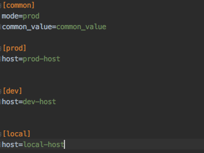

<p align="center">
</p>


# Welcome to Envmanager for Python Docs

1 - Define your schema as an enum or dictionary

2 - Load cfg files using the loader function or decorator:

3 - Use the same enum to get the keys, parsed according to the schema


Here is how your code may look like:

_schema_definition.py_
```python
from marshmallow import fields

schema = { 
    "an_int_value": int, # use builtin types like str, int, float to parse the variables
    "email": fields.Email(),  # use full power of Marshmallow validator to parse your environment varialbes
    "custom_key": MyCustomValidator(),  # you can pass your own validator object to validate and parse custom environment variables!
}

from envmanager import EnvManagerConfig

envloader_config = EnvManagerConfig( 
    env_paths=['path/to/my_env_file.cfg'], 
    schema=schema,  # optional
    eager_validate=True  # validate the schema values upon assigning them as environment variables 
)
```

*my_env.cfg*
```
[common]
an_int_value = 10
email = bytectgroup@gmail.com
custom_key = this_will_be_validated_by_me
```

_main.py_
```python
from envmanager.decorators import env_loader

@env_loader(envloader_config)  # saves all cfg file content onto the os.environ
def app_entry_point():
    from my_project import App  # ENSURE you do not import env-variable dependent code prior to envl_loader being called
    App.start()
```

_my_project.py_
```python
from envmanager import Env
env = Env(envloader_config)  # pass the same envloader config object to Env class

def app_entry_point():
    print(env('an_int_value'))  # prints as integer
    print(env('custom_key'))  # prints as expected by your custom validator/parser
    print(env('email'))  # prints valid email
```

## Documentation

### Guidelines


* Envmanager does stuff behind the scene to set and get environment variables. All keys will be prepended by uppercase
value of each group as specified in configuration (i.e. EnvManagerConfig object) to ensure no collision between identical
keys in two different groups.

### Environment Variable Files
> IMPORTANT NOTE: You must provide your environment variables inside a cfg file. No other file extension is supported at this point. Read more on cfg file format [here](https://docs.python.org/3/library/configparser.html). 


#### Sections:
Envmanager is created with scalability in mind. It is often the case that your environment variables are dependent on which environment your application is being run from (e.g. prod vs dev) while some variables are common.
The way Envmanager works is that it **takes exactly two sections per config file**: one **"common"** and one **"environment dependent"**.



Notice how the mode is named after the available section in the file. Changing the mode to dev will result in the host value being equal to 'dev-host' during run-time.

> You are NOT obligated to specify mode or any other section than the one you want. Either ensure the section name is set to "**common**" or specify the name using "**common_section_identifier**" argument of the configuration.

#### Mode
The mode, which tells the envmanager which section (in addition to the common section) is to be used, is denoted by the key "mode" by default.

If this value is missing, simply the common section values will be read and maybe validated/parsed (if schema is provided).

> In case you wish to denote this key by a different value, you need to override the default value via "**environment_identifier_key**" argument of the configuration.

### EnvManagerConfig class


## Loading the Env Variables


### Env class


### The (Custom) Validator class


## Issues
Please create an issue [here](https://github.com/arianseyedi/python-envmanager/issues). Please provide a brief
explanation and, if necessary, provide a snippet for reproducibility sake.

Cheers!

## Development
#### The First Timer:
* Once cloned, create a virtual environment using:
```
virtualenv -p python3 venv
```
then 
```shell script
pip3 install -r requirements.txt
```

create a new feature branch from develop, commit and submit a PR. It'll be much appreciated!

### Dependencies and special thanks!
This project heavily depends on the great work of other awesome developers of the open source world!
- [pytest](https://docs.pytest.org/en/latest/) by [anatoly](https://pypi.org/user/anatoly/), [flub](https://pypi.org/user/flub/) and [other](https://pypi.org/project/pytest/) awesome devs